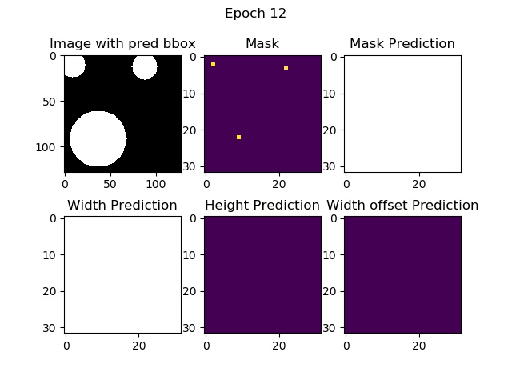
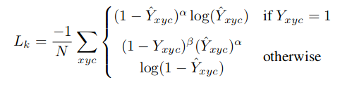

<!-- <script type="text/javascript" async
src="https://cdnjs.cloudflare.com/ajax/libs/mathjax/2.7.2/MathJax.js? 
config=TeX-MML-AM_CHTML"
</script> -->

This repo contains a minimalist implementation of the paper *Objects as Points* by Zhou et al. I found the approach pretty interesting and novel. It doesn't use anchor boxes and requires minimal post-processing. The essential idea of the paper is to treat objects as points denoted by their centers rather than bounding boxes. This idea is elegant and makes intuitive sense. And most importantly, it performs pretty well.The authors were able to achieve high accuracies on multiple tasks namely Object Detection on MSCOCO, 3D detection on Kitti and pose estimation ! 

## Dependencies 
- Python > 3.6
- Pytorch > 1.0

If you have installed pytorch in conda environment, it should work without much hassle.

## Running the model
No need to download any dataset. Just run python train.py to start training the model. The model outputs are saved in outputs folder.

## Model Outputs
The visualization of model output looks something like this.

Here are a few details about this implementation.

## The Toy dataset
MSCOCO or Kitti datasets are big and not everyone is interested in understanding them just to do a few experiments. So, I decided to write a function that automatically generates a toy dataset of circles.  The dataset generates an image with multiple circles (max 5]. The circles may overlap. 
## The Model
I didn't want to complicate things so I used resnet 18 as encoder and followed unet in the upsampling stages. Let's say the input to model is 1x1x256x256 (Batch Size x Channels x Width x Height), then output of
model will be 1x(N+4)x64x64. Here 1 is the batch size, N+4 is the number of output channels and 64 is the downsampled image width. Here $N$ is the number of object categories. In my implementation we only have one category of object i.e. circle. So, in our case the output is 1x5x64x64. Also, notice that we could have gone for complete upsampling like in UNET. The authors went for 64x64 size. An advantage of traning on downsampled images is that it reduces the number of parameters. 

Now an obvious question is if our model output is 4 times smaller [say 64] than the input image, then how are we going to get a fine prediction about the object location ? It seems like we can be off by 4 pixels both in height and width... The authors propose an innovative solution. They predict an offset map to finetune the object position. 
So, if model output is 1x5x64x64, the first channel (1x1x64x64) will be score of an object at those pixels, second and third channels represent the width and height. If coordinates say (30,23) are 1, it means that in the original image at the coordinate (30\*4,23\*4), some object may be present. The last 2 channels are offsets. It can be used to get better estimate of the object location.
Also, note that we use sigmoid activation for offsets. This ensures that they are bounded between $[0,1]$.

## The loss functions

We use two types of loss:
- Mask Loss

This is modified version of focal loss.  Here $\alpha$ and $\beta$ are parameters of focal loss. We use $\alpha=2$ and $\beta=4$. In original implementation, the authors use an object centered gaussian kernel
$Y = \exp(-\frac{(x-p_{x})^{2}+(y-p_{y})^{2} }{ 2\sigma^2 })$.
Here $p_{x}$ and $p_{y}$ are the low resolution center of the object. $\sigma$ is object size adaptive standard deviation. For this toy dataset,using gaussian kernel didn't seem to make much difference. So, in the interest of keeping it minimal I just use $Y (p_{x},p_{y}) = 1$.

- Size and offset Loss

For size and offset predictions,we basically use l1 loss normalized by the number of detected points.

## Training details

I used Adam optimizer with default settings. The model starts giving reasonable output after training for around 10 epochs.
We perform non maxima suppression [using Max pooling] on the model class maps. The top 100 predictions are selected. We use offset maps to finetune object coordinates. During visualization, I set a hard threshold of 0.25 i.e. if draw bounding box only if model confidence > 0.25. If you don't care about false alarms, you should probably set a lower threshold.

## Conclusion

I found the paper to be pretty interesting and elegant. I wanted to make the idea more accessible so i am sharing this code. I hope this minimalist implementation helps you in understanding the paper better.